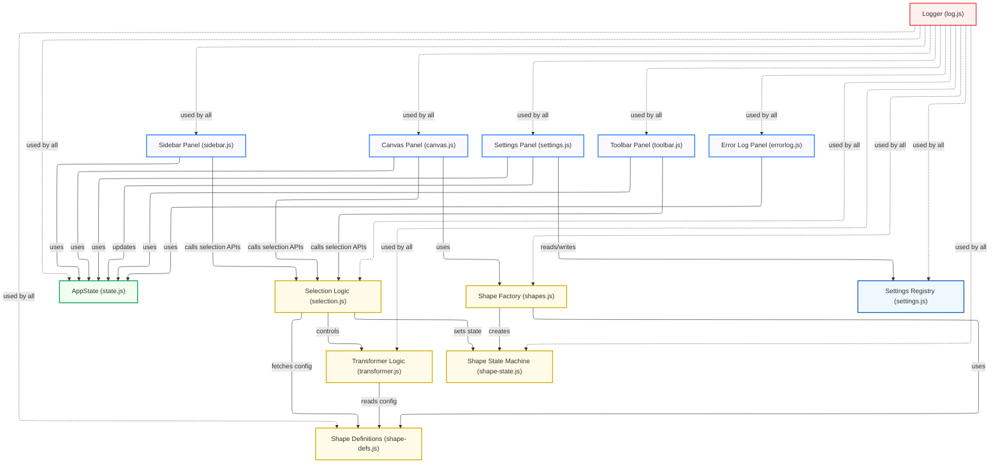

# Scene Designer – Mermaid Architecture Diagram

This diagram shows the core modular structure, state/data flow, and main dependencies as of the 2025 engineering refactor.

---

**How to read:**
- **AppState** is the central state singleton; all panels and logic modules interact only via exported APIs.
- **UI panels** (Sidebar, Canvas, Settings, Toolbar, ErrorLog) communicate with the state and selection APIs, never directly with each other.
- **Selection.js** centrally manages selection and transformer lifecycle.
- **transformer.js** is only invoked by selection.js.
- **Shape creation, config, and state** are separated into factory, definitions, and state machine modules.
- **Logging** is shared across all modules.
- **Settings** flow through the registry and SettingsPanel.

---

_You can render this diagram in any Mermaid-enabled Markdown viewer (e.g. GitHub, VSCode, Obsidian, Mermaid Live Editor)._

